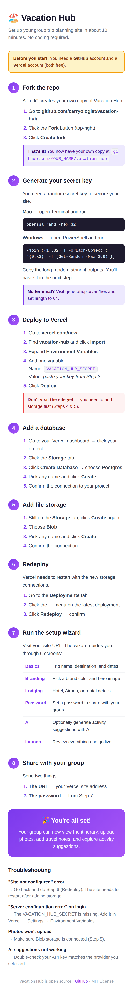

# Vacation Hub — Setup Guide

**Everything you need to get your group trip site running in about 10 minutes.**

You'll need a GitHub account and a Vercel account (both free) before you start.

<details>
<summary>📱 View this guide as a mobile-friendly image</summary>


</details>

---

## Step 1 — Fork the repo

A "fork" creates your own copy of Vacation Hub on GitHub.

1. Go to **[github.com/carryologist/vacation-hub](https://github.com/carryologist/vacation-hub)**
2. Click the **Fork** button (top-right corner)
3. On the next screen, leave everything as-is and click **Create fork**
4. Wait a few seconds — you now have your own copy at `github.com/YOUR_USERNAME/vacation-hub`

---

## Step 2 — Generate your secret key

You need a random secret key. This is used to secure passwords and sign login cookies.

**On a Mac:**
Open **Terminal** (search for it in Spotlight) and paste this command:
```
openssl rand -hex 32
```
Press Enter. Copy the long random string it outputs (it looks like `a4f8b2c1d9e7...`). Save it somewhere — you'll paste it in the next step.

**On Windows:**
Open **PowerShell** and paste:
```
-join ((1..32) | ForEach-Object { '{0:x2}' -f (Get-Random -Max 256) })
```
Copy the output.

**Don't have a terminal?** Use this website to generate a random string: [generate.plus/en/hex](https://generate.plus/en/hex) — set length to 64 characters.

---

## Step 3 — Deploy to Vercel

1. Go to **[vercel.com/new](https://vercel.com/new)**
2. You'll see a list of your GitHub repos — find **vacation-hub** and click **Import**
3. Before clicking Deploy, look for the **Environment Variables** section
4. Add one variable:
   - **Name:** `VACATION_HUB_SECRET`
   - **Value:** paste the secret key from Step 2
5. Click **Deploy**
6. Wait 1–2 minutes for the build to finish — you'll see a "Congratulations!" screen with a link to your new site

**Don't visit the site yet — you need to add storage first.**

---

## Step 4 — Add a database (Postgres)

Your site needs a database to store trip details, itinerary events, and more.

1. Go to your Vercel dashboard → click on your **vacation-hub** project
2. Click the **Storage** tab in the top navigation
3. Click **Create Database** → choose **Postgres**
4. Pick a name (anything is fine, like `vacation-hub-db`) and a region close to you
5. Click **Create**
6. When it asks to connect to your project, confirm it

This automatically sets the `POSTGRES_URL` environment variable for you.

---

## Step 5 — Add file storage (Blob)

Your site needs file storage for photo uploads.

1. Still on the **Storage** tab, click **Create** again
2. This time choose **Blob**
3. Pick a name (like `vacation-hub-photos`)
4. Click **Create** and confirm the connection

This automatically sets the `BLOB_READ_WRITE_TOKEN` environment variable for you.

---

## Step 6 — Redeploy

Vercel needs to restart with the new database and storage connections.

1. Go to the **Deployments** tab in your project
2. Find the most recent deployment
3. Click the **⋯** menu (three dots) on the right side
4. Click **Redeploy**
5. On the popup, click **Redeploy** again to confirm
6. Wait about 1 minute for it to finish

---

## Step 7 — Run the setup wizard

1. Click the link to your live site (it looks like `your-project-name.vercel.app`)
2. The **Setup Wizard** appears automatically — it walks you through 6 screens:

**Screen 1 — Trip Basics**
Enter your trip name (e.g., "CMA Fest 2026"), destination ("Nashville, TN"), and travel dates.

**Screen 2 — Branding**
Pick a brand color and optionally paste a hero image URL. You can use any image URL from the web — right-click an image, "Copy image address."

**Screen 3 — Lodging**
Add your hotel, Airbnb, or rental house details. You can add multiple properties. Include the address and any check-in/check-out info.

**Screen 4 — Password**
Choose a password that you'll share with your group. This protects the site — only people with the password can see your trip details.

**Screen 5 — AI Activity Suggestions** *(optional)*
If you want AI-generated activity suggestions for your destination:
1. Choose a provider: **OpenAI**, **Anthropic**, or **Google Gemini**
2. Paste your API key (you get this from the provider's website)
3. Click Generate

Don't have an API key? No problem — skip this step. You can always add activities manually later.

**Screen 6 — Review & Launch**
Review everything and click **Launch**. Your site is live!

---

## Step 8 — Share with your group

Send your group two things:
1. **The URL** — your Vercel site address (e.g., `your-project.vercel.app`)
2. **The password** — whatever you set in Step 7

That's it! Your group can now view the itinerary, add travel notes, upload photos, and check out activity suggestions.

---

## After setup — things you can do

- **Change the hero image** — click the camera icon on the homepage hero image
- **Add itinerary events** — go to the Schedule page and click "Add Activity"
- **Upload a PDF itinerary** — on the Schedule page, click "Upload Itinerary" to have AI extract events from a PDF
- **Add activities manually** — go to Things to Do and use the suggestion form
- **Upload photos** — go to the Photos page and drag-and-drop images
- **Add travel notes** — go to the Travel page so everyone can share their flight/drive info
- **Full reset** — go to Settings and click "Start Over" to wipe everything and re-run the wizard

---

## Troubleshooting

**"Site not configured" error after deploying**
→ You probably skipped Step 6 (Redeploy). The site needs to restart after adding storage.

**"Server configuration error" on login**
→ The `VACATION_HUB_SECRET` environment variable is missing. Go to Vercel → Project Settings → Environment Variables and add it.

**Setup wizard won't load**
→ Make sure both Postgres and Blob storage are connected (Step 4 & 5). Check the Storage tab in Vercel.

**Photos won't upload**
→ Make sure Blob storage is connected. Check for the `BLOB_READ_WRITE_TOKEN` in your project's Environment Variables.

**AI suggestions aren't generating**
→ Double-check your API key. Make sure it's for the correct provider (OpenAI key won't work with Anthropic, etc.).

---

*Built with Next.js, Tailwind CSS, and Vercel. [View on GitHub](https://github.com/carryologist/vacation-hub)*
